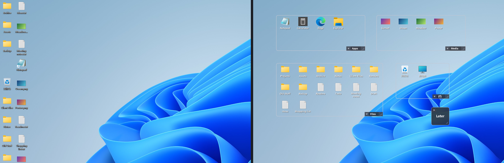
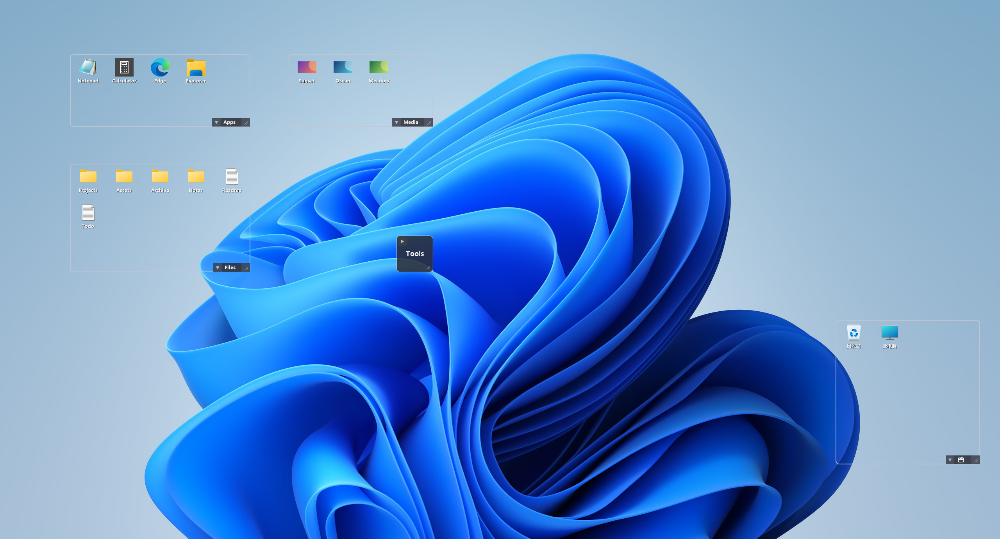
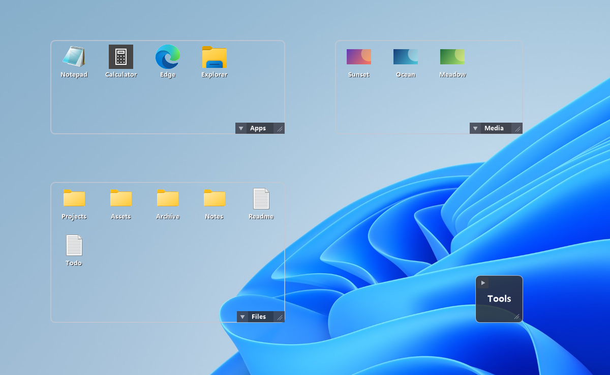
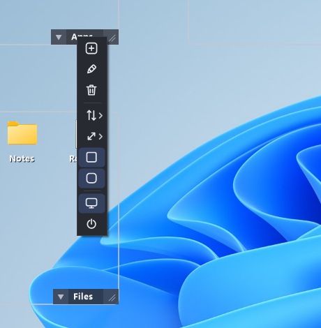
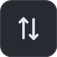
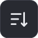

# DeskDrawer

DeskDrawer is a lightweight desktop organizer for Windows. It lets you group desktop icons into clean transparent boards while keeping the files exactly where they are.

It is designed to be quiet, local-first, and clean: one-time purchase, no ads, no telemetry, no subscriptions, and no bundled plugins or extensions.

| Boards up close | Icon-only menu |
|---|---|
|  |  |

## Why DeskDrawer?

DeskDrawer is built for people who want a cleaner desktop without installing a heavy desktop suite.

- One-time purchase, no subscription
- Lightweight transparent boards
- No ads, no telemetry, no bundled plugins
- No bulky board title bars
- No wasted board height
- Files stay in their original desktop location
- Native-feeling Windows desktop icon operations
- Runs quietly from the system tray

## Get it

- **Microsoft Store** — *coming soon.* One-time purchase; installed and updated through the
  Store (signed by Microsoft). Launch discount at release.
- This page is the product's home for documentation, changelog and support
  ([issues](../../issues)).

## Visual guide

The interface is icon-only — every control below is shown exactly as it appears in the app.

### The board

Each board has a compact widget in its **bottom-right corner**: `[▾ arrow] [name] [corner grip]`.

- **▾ arrow** — fold the board into a compact square / unfold it back
- **name block** — drag to move the board · double-click to rename it · **right-click for the board menu**
- **corner grip** — drag to resize (snaps to the icon grid, and flush against screen edges and other boards)
- With outlines hidden, the widget appears only while your mouse is over the board.

### Board menu — right-click the board's name

| Button | Action |
|:---:|---|
|  | **New board** |
|  | **Rename** this board (edits in place) |
|  | **Delete** this board — its icons return to the default board; files are never touched |
|  | **Sorting** submenu (below) |
|  | **Icon size** submenu — four sizes     |
|  | Toggle the board **outline** |
|  | Toggle **rounded corners** |
|  | **Quit DeskDrawer** (native desktop icons come back) |

### Sorting submenu

| Button | Order |
|:---:|---|
|  | **Manual** — your drag order (drag icons to rearrange) |
|  | By **name** |
|  | By **type** |
|  | By **file size** |
|  | By **date created** |
|   | Direction: **ascending / descending** |

### Tray menu — right-click the DeskDrawer tray icon

| Button | Action |
|:---:|---|
|  | **New board** |
|  | **Fix misplaced boards** — boards that are off-screen, under the taskbar, or overlapping get re-placed (snapped next to other boards); well-placed boards are not moved |
|  | **Switch view** — toggle between your boards and the plain Windows desktop. Checked = board view (boards shown, native icons hidden); unchecked = the normal desktop (boards hidden, native icons back). The two are never shown at once, and creating a new board switches back to board view |
|  | **Run at startup** (also manageable in Task Manager → Startup apps) |
|  | **Open the configuration folder** (your layout lives in `config.json` there) |
|  | **Help & feedback** — opens this page |
|  | **Quit** (restores the native desktop icons) |

### Mouse & keyboard

| Gesture / key | Effect |
|---|---|
| Drag on empty board space **or the bare desktop** | **Rubber-band select** — the band spans multiple boards; hold `Ctrl` to add to the selection |
| Drag selected icons | Move them between boards (or reorder within one); drag **out** to an Explorer window to copy/move the real files |
| Drag files **from** Explorer onto a board | The files land on the desktop and join that board |
| Right-click an icon | The real Windows context menu (Open with, Send to, and extensions included) |
| Right-click empty board space | The real Windows **desktop** menu — "New" files are created in that board |
| Mouse wheel over a board | Scroll the board |
| `Enter` / double-click | Open |
| `F2` | Rename file |
| `Delete` | Recycle (with Windows' confirmation for permanent deletes) |
| `Ctrl+A` / `Ctrl+C` / `Ctrl+X` / `Ctrl+V` | Select all in board / copy / cut / paste (paste lands in the board under your pointer) |
| `Esc` | Clear selection |

## Support & feedback

- 🐛 **Bug reports & feature requests:** [GitHub Issues](../../issues)
- ✉️ **Email:** [freeketchup@icloud.com](mailto:freeketchup@icloud.com)

When reporting a problem, attaching `error.log` from the configuration folder (tray menu →
) helps a lot. DeskDrawer has no telemetry — these two channels
are the only way we learn about issues, so every report genuinely matters.

## Privacy

DeskDrawer does not collect personal data.

DeskDrawer does not include ads, telemetry, analytics SDKs, account systems, bundled plugins, or unnecessary extensions. The app is designed to run locally on your Windows device.

DeskDrawer stores only the local configuration required to remember your boards, icon assignments, layout, and preferences.

Full policy: [PRIVACY.md](PRIVACY.md)

## Uninstall

DeskDrawer does not move your desktop files. If you uninstall DeskDrawer, your files remain on the desktop.

To remove DeskDrawer, first quit it from the tray menu ( — this
restores the native icons), then uninstall it from Windows Settings. If you use a portable
build, delete the executable and its local configuration folder.

If the desktop happens to look empty right after uninstalling while DeskDrawer was still running,
don't worry: the native icons come back automatically at your next sign-in. To bring them back
immediately, right-click the desktop → **View** → **Show desktop icons** (click it twice if it
already shows a check mark).

## FAQ

### Does DeskDrawer move my files?

No. Your files stay on the desktop. DeskDrawer only remembers which board each icon belongs to.

### Does DeskDrawer show ads or collect telemetry?

No. DeskDrawer has no ads, no telemetry, no subscriptions, and no bundled plugins or extensions.

### Why does DeskDrawer not use large board title bars?

Desktop space is valuable. DeskDrawer keeps controls compact so each board uses more space for your icons, not for the tool itself.

### Is DeskDrawer a heavy desktop suite?

No. DeskDrawer is designed as a lightweight desktop organizer. It runs quietly from the system tray and focuses only on organizing your desktop icons.

## License

Proprietary — one-time purchase. See [LICENSE](LICENSE).
