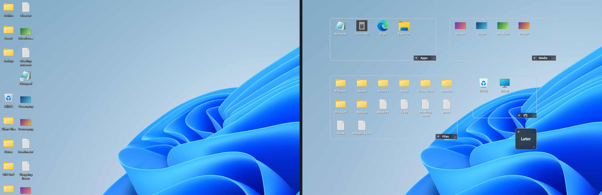
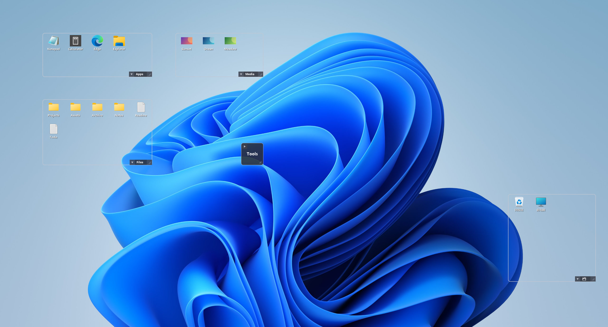
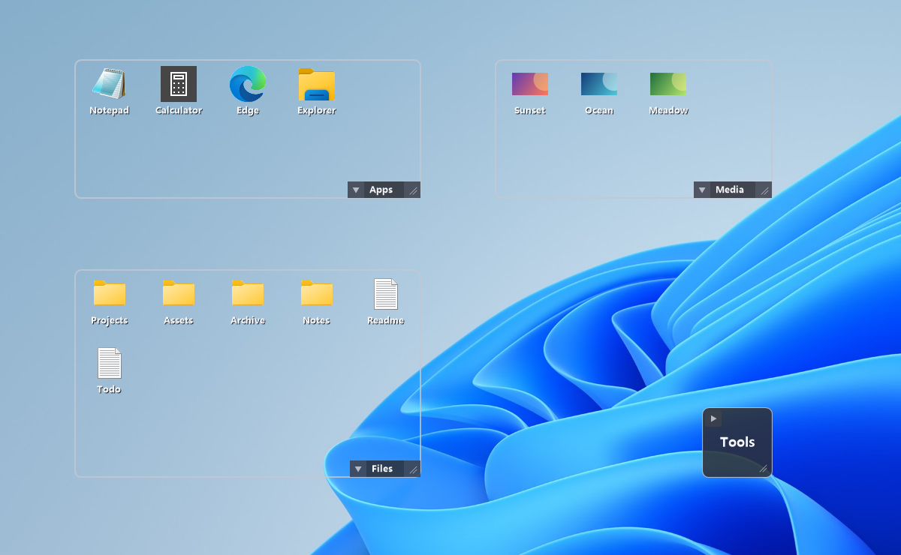
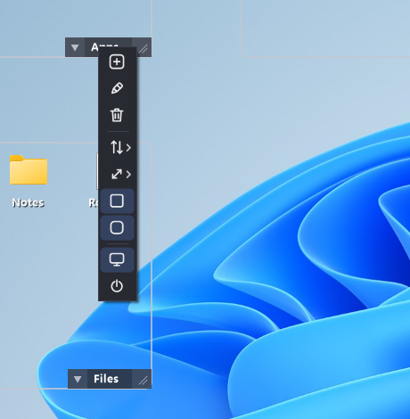
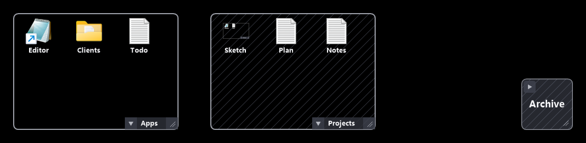

# DeskDrawer

DeskDrawer is a lightweight desktop organizer for Windows. It groups your desktop icons into clean transparent boards — and, when you want it, turns a board into a real folder on your desktop.

It is designed to be quiet, local-first, and clean: one-time purchase, no ads, no telemetry, no subscriptions, and no bundled plugins or extensions.

**Website: [deskdrawer.pages.dev](https://deskdrawer.pages.dev/)** · **[Get it on the Microsoft Store](https://apps.microsoft.com/detail/9n904wfphzfz)**

> **Full documentation is on the website.** This README is a quick visual guide; the site has the
> complete manual, and it is the canonical source for how DeskDrawer behaves.
>
> [Getting started](https://deskdrawer.pages.dev/docs/getting-started/) ·
> [All documentation](https://deskdrawer.pages.dev/docs/) ·
> [Questions & answers](https://deskdrawer.pages.dev/faq/) ·
> [Glossary](https://deskdrawer.pages.dev/glossary/) ·
> [Troubleshooting](https://deskdrawer.pages.dev/docs/troubleshooting/) ·
> [Limitations](https://deskdrawer.pages.dev/docs/limitations/) ·
> [Release notes](https://deskdrawer.pages.dev/changelog/) ·
> [Engineering notes](https://deskdrawer.pages.dev/notes/)

## Icon reference

The interface is icon-only. Every button is shown below exactly as it appears in the app.

### Board menu — right-click the board's name

| Button | Action |
|:---:|---|
|  | **New board** |
|  | **Rename** this board (edits in place) |
|  | **Delete** this board — its icons return to the default board |
|  | **Make it a folder board** — the arrow points *into* the folder: a real folder named after the board is created on your desktop and the board's files move into it ([folder boards](#folder-boards)). Not available on the default board, or on a board that holds a system icon such as This PC or the Recycle Bin |
|  | **Make it an ordinary board again** — shown on a folder board; the arrow points *out*: the files move back onto the desktop and the emptied folder is removed |
|  | **Sorting** submenu (below) |
|  | **Fill rows** — icons run left to right, then wrap down (the default) |
|  | **Fill columns** — icons run top to bottom, then wrap right. Set per board |
|  | **Icon size** submenu — four sizes     |
|  | Toggle the board **outline** |
|  | Toggle **rounded corners** |
|  | **Quit DeskDrawer** (native desktop icons come back) |

### Sorting submenu

| Button | Order |
|:---:|---|
|  | **Manual** — your drag order (drag icons to rearrange) |
|  | By **name** |
|  | By **type** |
|  | By **file size** |
|  | By **date created** |
|   | Direction: **ascending / descending** |

### Tray menu — right-click the DeskDrawer tray icon

| Button | Action |
|:---:|---|
|  | **New board** |
|  | **Fix misplaced boards** — boards that are off-screen, under the taskbar, or overlapping get re-placed (snapped next to other boards); well-placed boards are not moved |
|  | **Switch view** — toggle between your boards and the plain Windows desktop. Checked = board view (boards shown, native icons hidden); unchecked = the normal desktop (boards hidden, native icons back). The two are never shown at once, and creating a new board switches back to board view |
|  | **Shortcut arrows** — show or hide the small arrow in the corner of shortcut icons, like the one on the Windows desktop. Checked (the default) = shown |
|  | **Bring back system icons** — appears only after you have removed a system icon (This PC, Recycle Bin, …) from a board with `Delete`; click it to show them again. It is not in the menu otherwise |
|  | **Run at startup** (also manageable in Task Manager → Startup apps) |
|  | **Open the configuration folder** (your layout lives in `config.json` there) |
|  | **Help & feedback** — opens this page |
|  | **Quit** (restores the native desktop icons) |

### On the boards themselves

| You see | It means |
|---|---|
| A board with faint **diagonal stripes** (also on its folded square) | A **folder board**: its icons are the contents of a real folder on your desktop |
| A small **arrow** in the bottom-left corner of an icon | A **shortcut** — toggle with  in the tray menu |

## See it

| Boards up close | Icon-only menu |
|---|---|
|  |  |

*An ordinary board (left), a folder board (middle), and a folder board folded into a square (right).*

## Why DeskDrawer?

DeskDrawer is built for people who want a cleaner desktop without installing a heavy desktop suite.

- One-time purchase, no subscription
- Lightweight transparent boards
- No ads, no telemetry, no bundled plugins
- No bulky board title bars
- No wasted board height
- Ordinary boards never move your files — they only group the icons
- Folder boards, when you want a board to be a real folder
- Native-feeling Windows desktop icon operations
- Runs quietly from the system tray

## Get it

- **[Get it on the Microsoft Store](https://apps.microsoft.com/detail/9n904wfphzfz)** — one-time
  purchase; installed and updated through the Store (signed by Microsoft).
- **Website:** [deskdrawer.pages.dev](https://deskdrawer.pages.dev/)
- This page is the product's home for documentation, changelog and support
  ([issues](../../issues)).

## How it works

### The board

Each board has a compact widget in its **bottom-right corner**: `[▾ arrow] [name] [corner grip]`.

- **▾ arrow** — fold the board into a compact square / unfold it back
- **name block** — drag to move the board · double-click to rename it · **right-click for the board menu**
- **corner grip** — drag to resize (snaps to the icon grid, and flush against screen edges and other boards)
- With outlines hidden, the widget appears only while your mouse is over the board.

### Folder boards

An ordinary board only *groups* icons — the files stay loose on your desktop. A **folder board** is
backed by a real folder instead: `Desktop\<board name>`. The board shows what is inside that folder,
and the folder itself never appears on any board. Folder boards look like any other board, plus faint
diagonal stripes (they stay on the folded square too).

- **Make one:** board menu → . The folder is created and the
  board's files move into it, keeping their order. Items that cannot live in a folder stay where they
  were and go back to the default board (for example shortcuts from the shared *Public* desktop, which
  need administrator rights to move). A board that holds a system icon — This PC, the Recycle Bin — can't
  be converted, and system icons can't be dropped into a folder board.
- **Use it like any board:** drag icons in and out (the files really move into the folder or back onto
  the desktop), paste or drop files from Explorer (they land in the folder), or right-click the board's
  empty space → **New** (the new file goes into the folder).
- **Rename the board** and the folder is renamed with it. A name Windows does not allow for a folder
  (`\ / : * ? " < > |`, a trailing dot, a reserved name like `CON`) or one already taken on the desktop
  is refused, and the board keeps its old name.
- **Rename or delete the folder in Explorer** and the board follows: it takes the new name, or — if the
  folder is gone — becomes an ordinary, empty board.
- **Make it ordinary again** () or **delete the board**: the files
  move back onto the desktop and the empty folder is removed. If something can't move (a file that is
  open in another program), the board stays a folder board and nothing is lost — try again later.

Nothing is ever overwritten: converting, turning back and dragging use the standard Windows file
operation, which renames a clash Windows' way (`name - Copy`), and a new file swept into the folder
gets a free name (`name (2)`) if the folder already has one.

### Mouse & keyboard

| Gesture / key | Effect |
|---|---|
| Drag on empty board space **or the bare desktop** | **Rubber-band select** — the band spans multiple boards; hold `Ctrl` to add to the selection |
| Drag selected icons | Move them between boards (or reorder within one); drag **out** to an Explorer window to copy/move the real files. Into or out of a folder board, the files move too |
| Drag files **from** Explorer onto a board | The files land on the desktop and join that board — or, on a folder board, land in its folder |
| Right-click an icon | The real Windows context menu (Open with, Send to, and extensions included) |
| Right-click empty board space | The real Windows **desktop** menu — "New" files are created in that board (in a folder board's folder) |
| Mouse wheel over a board | Scroll the board |
| `Enter` / double-click | Open |
| `F2` | Rename file |
| `Delete` | Recycle (with Windows' confirmation for permanent deletes) |
| `Ctrl+A` / `Ctrl+C` / `Ctrl+X` / `Ctrl+V` | Select all in board / copy / cut / paste (paste lands in the board under your pointer) |
| `Esc` | Clear selection |

## Support & feedback

- 🐛 **Bug reports & feature requests:** [GitHub Issues](../../issues)
- ✉️ **Email:** [freeketchup@icloud.com](mailto:freeketchup@icloud.com)

When reporting a problem, attaching `error.log` from the configuration folder (tray menu →
) helps a lot. DeskDrawer has no telemetry — these two channels
are the only way we learn about issues, so every report genuinely matters.

## Privacy

DeskDrawer does not collect personal data.

DeskDrawer does not include ads, telemetry, analytics SDKs, account systems, bundled plugins, or unnecessary extensions. The app is designed to run locally on your Windows device.

DeskDrawer stores only the local configuration required to remember your boards, icon assignments, layout, and preferences.

Full policy: [PRIVACY.md](PRIVACY.md)

## Uninstall

DeskDrawer never deletes your files. Files on ordinary boards stay on the desktop; files on a folder
board stay in that board's folder on the desktop, where they remain as an ordinary folder after you
uninstall. (To have them loose on the desktop again, turn the folder board back into an ordinary board
with  before uninstalling.)

To remove DeskDrawer, first quit it from the tray menu ( — this
restores the native icons), then uninstall it from Windows Settings. If you use a portable
build, delete the executable and its local configuration folder.

If the desktop happens to look empty right after uninstalling while DeskDrawer was still running,
don't worry: the native icons come back automatically at your next sign-in. To bring them back
immediately, right-click the desktop → **View** → **Show desktop icons** (click it twice if it
already shows a check mark).

## FAQ

### Does DeskDrawer move my files?

Ordinary boards: no. Your files stay on the desktop, and DeskDrawer only remembers which board each
icon belongs to.

Folder boards: yes — that is what they are for, and only when you ask. Turning a board into a folder
board, or dragging icons into or out of one, moves those files between the desktop and the board's
folder on the desktop, through the standard Windows file operation. Nothing is overwritten or deleted.

### Does DeskDrawer show ads or collect telemetry?

No. DeskDrawer has no ads, no telemetry, no subscriptions, and no bundled plugins or extensions.

### Why does DeskDrawer not use large board title bars?

Desktop space is valuable. DeskDrawer keeps controls compact so each board uses more space for your icons, not for the tool itself.

### Is DeskDrawer a heavy desktop suite?

No. DeskDrawer is designed as a lightweight desktop organizer. It runs quietly from the system tray and focuses only on organizing your desktop icons.

## License

Proprietary — one-time purchase. See [LICENSE](LICENSE).
